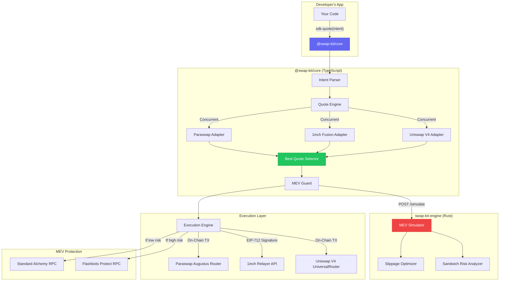

<div align="center">

# 🔀 SwapKit

### The Intent-Based Unified Liquidity Layer for Web3

**One SDK. Every DEX. Zero MEV.**

Stop integrating Uniswap, 1inch, and Paraswap separately.
Write 4 lines of code and let SwapKit find the best route, simulate MEV risk, and execute safely.

[](https://www.npmjs.com/package/@swap-kit/core)
[](https://opensource.org/licenses/MIT)
[]()

[Getting Started](#-getting-started) •
[How It Works](#-how-it-works) •
[API Reference](#-api-reference) •
[CLI](#-cli) •
[Architecture](#-architecture)

</div>

---

## 📖 Table of Contents

- [The Problem](#-the-problem)
- [Our Solution](#-our-solution)
- [Getting Started](#-getting-started)
- [How It Works (Step by Step)](#-how-it-works)
- [API Reference](#-api-reference)
- [CLI Usage](#-cli)
- [Architecture Deep Dive](#-architecture)
- [API Keys Guide](#-api-keys-guide)
- [Self-Hosting the Rust Engine](#-self-hosting-the-rust-engine)
- [FAQ](#-faq)

---

## 😰 The Problem

Building a token swap feature in a Web3 app is an engineering nightmare. In 2024–2026, liquidity is fragmented across completely different execution architectures:

### The Three Worlds of DeFi Execution

```
┌─────────────────────────────────────────────────────────────────────────┐
│                    THE FRAGMENTED DeFi LANDSCAPE                        │
├──────────────────┬──────────────────────┬───────────────────────────────┤
│   Uniswap V4     │   1inch Fusion+      │   Paraswap                   │
│   (On-Chain)     │   (Off-Chain Intent) │   (On-Chain Aggregator)      │
├──────────────────┼──────────────────────┼───────────────────────────────┤
│ • Singleton      │ • No on-chain TX     │ • Traditional API            │
│   PoolManager    │ • EIP-712 signatures │ • Routes across 30+ DEXs     │
│ • Custom Hooks   │ • HTLC secrets for   │ • Returns standard           │
│ • UniversalRouter│   cross-chain        │   calldata                   │
│   binary encoding│ • Resolver network   │ • No MEV protection          │
│ • V4_SWAP command│   executes for you   │                              │
│   + Actions      │ • Gasless for maker  │                              │
├──────────────────┼──────────────────────┼───────────────────────────────┤
│ SDK: @uniswap/   │ SDK: @1inch/         │ SDK: REST API                │
│ v4-periphery     │ cross-chain-sdk      │ api.paraswap.io              │
│                  │                      │                              │
│ Complexity: 🔴   │ Complexity: 🔴       │ Complexity: 🟡              │
└──────────────────┴──────────────────────┴───────────────────────────────┘
```

**If you want the best price for your users, you must integrate ALL THREE.** That means:

1. Learning 3 completely different APIs and execution models
2. Handling on-chain transactions AND off-chain signatures
3. Managing cross-chain HTLC secrets (1inch Fusion+)
4. Encoding binary UniversalRouter payloads (Uniswap V4)
5. Building your own MEV protection (or your users get sandwiched)
6. Dealing with 3 different error handling patterns

**This takes 3-5 weeks of engineering per project.** Every team rebuilds it from scratch.

### The MEV Problem

Even after integrating all the DEXs, there's another monster: **MEV (Maximum Extractable Value)**.

When a user submits a swap transaction on Ethereum, it sits in the **public mempool** — a waiting room visible to everyone. Predatory bots watch this mempool 24/7. When they spot a large swap, they execute a **Sandwich Attack**:

```
Without MEV Protection:

    User submits: "Swap 10 ETH → USDC"
         │
         ▼
    ┌─────────────────────────┐
    │   PUBLIC MEMPOOL        │  ◄── Bot sees your transaction!
    │   (visible to everyone) │
    └─────────────────────────┘
         │
         ▼
    Bot FRONT-RUNS: Buys token first (pushes price UP)
         │
         ▼
    Your swap executes at WORSE price ($2,000 instead of $2,050)
         │
         ▼
    Bot BACK-RUNS: Sells token (takes profit)
         │
         ▼
    You lost ~$50 to the sandwich bot 💸
```

---

## 💡 Our Solution

SwapKit eliminates all of this complexity. You describe **what** you want (an Intent), and SwapKit figures out the **how**.

### Before SwapKit (The Old Way)

```typescript
// ❌ WITHOUT SwapKit — 200+ lines of protocol-specific code

// Step 1: Set up Uniswap V4
const poolKey = { currency0, currency1, fee: 500, tickSpacing: 10, hooks: "0x..." };
const actions = encodePacked([SWAP_EXACT_IN_SINGLE, SETTLE_ALL, TAKE_ALL]);
const params = encodeAbiParameters([...], [{ poolKey, zeroForOne, amountIn, ... }]);
const commands = "0x10"; // V4_SWAP command
const calldata = encodeFunctionData({ abi: UniversalRouterABI, ... });

// Step 2: Set up 1inch Fusion+ (completely different model!)
const fusionSdk = new SDK({ url: "https://api.1inch.dev/fusion-plus", authKey: KEY });
const quote = await fusionSdk.getQuote({ srcChainId, dstChainId, ... });
const order = fusionSdk.createOrder(quote, { walletAddress, hashLock, secretHashes, ... });
const signature = await walletClient.signTypedData(order.typedData);
await fusionSdk.submitOrder(srcChainId, order, quoteId, secretHashes);

// Step 3: Set up Paraswap (yet another API!)
const paraswapQuote = await fetch("https://api.paraswap.io/prices?...");
const txParams = await fetch("https://api.paraswap.io/transactions/1?...");

// Step 4: Compare all three, handle errors, manage MEV...
// ... another 100 lines of comparison, error handling, and retry logic
```

### After SwapKit (The New Way)

```typescript
// ✅ WITH SwapKit — 4 lines. That's it.

import { createSwapKit } from "@swap-kit/core";

const sdk = createSwapKit({ oneInchApiKey: process.env.ONEINCH_KEY });

const quotes = await sdk.quote({
  fromToken: "0xEeee...EEeE",  // ETH
  toToken: "0xA0b8...eB48",    // USDC
  fromAmount: 1000000000000000000n, // 1 ETH
  fromChainId: 1,
});

// quotes[0] is already the best route with MEV analysis applied
console.log(quotes[0].protocol);    // "paraswap" or "1inch-fusion" or "uniswap-v4"
console.log(quotes[0].amountOut);   // Best price across all DEXs
console.log(quotes[0].mevExposure); // MEV risk estimate
```

---

## 🚀 Getting Started

### Step 1: Install the SDK

```bash
npm install @swap-kit/core
# or
pnpm add @swap-kit/core
# or
yarn add @swap-kit/core
```

### Step 2: Get Your API Keys

SwapKit needs **one required key** (Alchemy for blockchain access) and has **one optional key** (1inch for intent-based swaps):

| Key | Required? | Where to Get It | Free? |
|-----|-----------|-----------------|-------|
| **Alchemy RPC** | ✅ Yes | [alchemy.com](https://www.alchemy.com/) | Yes (free tier) |
| **1inch API** | ⬡ Optional | [portal.1inch.dev](https://portal.1inch.dev/) | Yes (free tier) |
| Paraswap | ❌ No key needed | Open API | Free |
| DefiLlama | ❌ No key needed | Open API | Free |
| Flashbots | ❌ No key needed | Public RPC | Free |

> **Without the 1inch key**, SwapKit still works perfectly — it routes across Uniswap V4 and Paraswap. The 1inch key simply adds Fusion+ as an additional routing option for potentially better prices.

### Step 3: Initialize the SDK

```typescript
import { createSwapKit } from "@swap-kit/core";

// Minimal setup (Paraswap + Uniswap V4 only — no API key needed!)
const sdk = createSwapKit({
  oneInchApiKey: "", // Leave empty to skip 1inch
});

// Full setup (all three protocols)
const sdk = createSwapKit({
  oneInchApiKey: process.env.ONEINCH_API_KEY!,
  rustEngineUrl: "http://localhost:3030", // Optional: for MEV protection
  mevFailOpen: true, // If Rust engine is down, still execute (default: true)
});
```

### Step 4: Get a Quote

```typescript
// Define what you want to swap
const quotes = await sdk.quote({
  fromToken: "0xEeeeeEeeeEeEeeEeEeEeeEEEeeeeEeeeeeeeEEeE", // ETH
  toToken: "0xA0b86991c6218b36c1d19D4a2e9Eb0cE3606eB48",   // USDC
  fromAmount: 1000000000000000000n, // 1 ETH (18 decimals)
  fromChainId: 1,                   // Ethereum Mainnet
  maxSlippageBps: 50,               // 0.5% max slippage
});

// The SDK returns quotes sorted by best net output
console.log(`Best route: ${quotes[0].protocol}`);
console.log(`You receive: ${quotes[0].amountOut} USDC`);
console.log(`MEV risk: ${quotes[0].mevExposure}`);
```

### Step 5: Execute the Swap

```typescript
import { createWalletClient, createPublicClient, http } from "viem";
import { privateKeyToAccount } from "viem/accounts";
import { mainnet } from "viem/chains";

// Create a wallet (in production, this comes from MetaMask/WalletConnect)
const walletClient = createWalletClient({
  account: privateKeyToAccount("0xYOUR_PRIVATE_KEY"),
  chain: mainnet,
  transport: http("https://eth-mainnet.g.alchemy.com/v2/YOUR_ALCHEMY_KEY"),
});

const publicClient = createPublicClient({
  chain: mainnet,
  transport: http("https://eth-mainnet.g.alchemy.com/v2/YOUR_ALCHEMY_KEY")
});

// Execute!
const intent = {
  fromToken: "0xEeeeeEeeeEeEeeEeEeEeeEEEeeeeEeeeeeeeEEeE", // ETH
  toToken: "0xA0b86991c6218b36c1d19D4a2e9Eb0cE3606eB48",   // USDC
  fromAmount: 1000000000000000000n, // 1 ETH
  fromChainId: 1,
};

const result = await sdk.swap(
  intent,
  walletClient,
  publicClient
);

console.log(`✅ Swap executed! TX: ${result.txHash}`);
console.log(`Received: ${result.actualAmountOut} USDC`);
console.log(`Gas paid: ${result.gasPaidWei} wei`);
```

---

## 🔍 How It Works

Here is exactly what happens when you call `sdk.quote()` and `sdk.swap()`:

### Phase 1: Parallel Scanning

When you request a quote, SwapKit fires off **simultaneous** requests to all three protocols:

```
sdk.quote({ fromToken: ETH, toToken: USDC, amount: 1 ETH })
    │
    ├──→ Uniswap V4 Adapter
    │       └─ Calls QuoterV2 contract via eth_call (on-chain simulation)
    │       └─ Returns: 2,018.47 USDC
    │
    ├──→ 1inch Adapter
    │       └─ Calls 1inch REST API (/swap/v6.0/1/quote)
    │       └─ Returns: 2,017.10 USDC
    │
    └──→ Paraswap Adapter
            └─ Calls Paraswap REST API (/prices)
            └─ Returns: 2,022.15 USDC  ◄── Winner!
```

All three run **concurrently** using `Promise.all`, so the total time is only as slow as the slowest API (~200ms), not the sum of all three.

### Phase 2: MEV Simulation (Rust Engine)

Before returning the quote, SwapKit sends the winning route to the Rust engine for safety analysis:

```
Best Quote (Paraswap, 2,022.15 USDC)
    │
    ▼
Rust Engine POST /simulate
    │
    ├─ Checks trade size against pool liquidity
    ├─ Estimates sandwich attack profitability
    ├─ Calculates optimal slippage tolerance
    │
    ▼
Returns: { sandwichRisk: "low", recommendedSlippage: 30bps }
```

If the Rust engine detects **high MEV risk**, the SDK can automatically:
- Lower the slippage tolerance to make sandwich attacks unprofitable
- Route the transaction through **Flashbots Protect** (a private submission channel that hides your transaction from bots)

> **What if I don't run the Rust engine?** The SDK works perfectly without it. It simply skips the MEV simulation step and uses the default slippage you set (e.g., 0.5%). Think of the Rust engine as an optional safety upgrade.

### Phase 3: Unified Execution

SwapKit abstracts the completely different execution models behind a single `.swap()` call:

```
sdk.swap(intent, walletClient, publicClient)
    │
    ├─ If winner is Uniswap V4:
    │     1. Encode UniversalRouter calldata (V4_SWAP + SETTLE_ALL + TAKE_ALL)
    │     2. Build Ethereum transaction
    │     3. Send via walletClient.sendTransaction()
    │     4. Wait for on-chain confirmation
    │
    ├─ If winner is 1inch Fusion+:
    │     1. Create EIP-712 typed data order
    │     2. Request signature from wallet (NOT a transaction!)
    │     3. Submit signed intent to 1inch Relayer API
    │     4. Resolvers execute the trade (gasless for the user!)
    │
    └─ If winner is Paraswap:
          1. Fetch transaction params from Paraswap API
          2. Build Ethereum transaction
          3. Send via walletClient.sendTransaction()
          4. Wait for on-chain confirmation
```

**You don't need to know ANY of this.** Just call `sdk.swap()` and it handles everything.

---

## 📚 API Reference

### `createSwapKit(config)`

Creates a new SwapKit instance.

```typescript
const sdk = createSwapKit({
  oneInchApiKey: string,         // Your 1inch API key (pass "" to skip)
  rustEngineUrl?: string,        // URL of the Rust MEV engine (optional)
  mevFailOpen?: boolean,         // If true, skip MEV check when engine is down (default: true)
});
```

### `sdk.quote(intent)`

Fetches quotes from all supported protocols.

```typescript
const quotes: QuoteResult[] = await sdk.quote({
  fromToken: Address,        // Source token contract address
  toToken: Address,          // Destination token contract address
  fromAmount: bigint,        // Amount in wei (smallest unit)
  fromChainId: number,       // Source chain (1 = Ethereum, 8453 = Base, 42161 = Arbitrum)
  toChainId?: number,        // Destination chain (defaults to fromChainId)
  maxSlippageBps?: number,   // Max slippage in basis points (50 = 0.5%)
  recipient?: Address,       // Receiving address (defaults to sender)
  deadline?: number,         // Unix timestamp deadline
  skipMEVCheck?: boolean,    // Skip Rust engine simulation
});
```

**Returns**: `QuoteResult[]` sorted by best net output (after gas + MEV estimates).

### `sdk.swap(intent, walletClient, publicClient)`

Quotes and executes the best swap in one call.

```typescript
const result: SwapResult = await sdk.swap(intent, walletClient, publicClient);

// result.txHash        — Transaction hash (or order hash for 1inch)
// result.protocol      — Which protocol won ("uniswap-v4" | "1inch-fusion" | "paraswap")
// result.actualAmountOut — Tokens received
// result.gasPaidWei    — Gas cost in wei
```

### `sdk.bestQuote(intent)`

Convenience method that returns only the single best quote.

```typescript
const best: QuoteResult = await sdk.bestQuote(intent);
```

---

## 💻 CLI

SwapKit ships with a beautiful command-line interface for quick testing.

### Installation

```bash
npm install -g @swap-kit/cli
# or run directly
npx @swap-kit/cli quote --from 0xEeee...EEeE --to 0xA0b8...eB48 --amount 1
```

### Commands

```bash
# Get the best quote across all protocols
swap-kit quote \
  --from 0xEeeeeEeeeEeEeeEeEeEeeEEEeeeeEeeeeeeeEEeE \
  --to 0xA0b86991c6218b36c1d19D4a2e9Eb0cE3606eB48 \
  --amount 1 \
  --chain 1

# Output:
# ✔ Route optimized successfully!
#
# 🏆 Best Quote Found:
# Protocol:      paraswap
# Amount Out:    2,022.15
# MEV Exposure:  Protected 🛡️
```

---

## 🏗 Architecture



### Monorepo Structure

```
swap-kit/
├── packages/
│   ├── core/              ← @swap-kit/core (TypeScript SDK)
│   │   ├── src/
│   │   │   ├── adapters/  ← Protocol adapters (Uniswap, 1inch, Paraswap)
│   │   │   ├── quote/     ← Parallel quote engine
│   │   │   ├── execution/ ← Unified execution layer
│   │   │   ├── mev/       ← MEV guard & slippage optimization
│   │   │   ├── intent/    ← Intent parser & validation (Zod)
│   │   │   └── index.ts   ← Main SwapKit class
│   │   └── package.json
│   │
│   ├── cli/               ← @swap-kit/cli (Terminal Interface)
│   │   ├── src/
│   │   │   ├── index.ts   ← Commander.js CLI
│   │   │   └── utils.ts   ← Formatting helpers
│   │   └── package.json
│   │
│   ├── react/             ← @swap-kit/react (Coming Soon)
│   └── contracts/         ← Solidity (SwapKitRouter + SwapKitHook)
│
├── crates/
│   ├── swap-kit-engine/   ← Rust MEV simulator (Axum server)
│   └── swap-kit-types/    ← Shared Rust types
│
└── README.md
```

---

## 🔑 API Keys Guide

### For Developers Using Our SDK

When you install `@swap-kit/core`, you provide **your own** API keys. SwapKit never bundles any keys — you bring your own.

```typescript
// Your keys, your quotas, your control
const sdk = createSwapKit({
  oneInchApiKey: process.env.MY_1INCH_KEY!,
});
```

### Where to Get Each Key

#### 1. Alchemy (Required — for blockchain RPC access)

1. Go to [alchemy.com](https://www.alchemy.com/) and sign up (free)
2. Create a new app → Select "Ethereum Mainnet"
3. Copy the API key from the dashboard
4. Use it in your RPC URLs: `https://eth-mainnet.g.alchemy.com/v2/YOUR_KEY`

#### 2. 1inch (Optional — enables Fusion+ intent swaps)

1. Go to [portal.1inch.dev](https://portal.1inch.dev/) and sign up
2. Navigate to API Keys → Create a new key
3. Enable the "Swap API" and "Fusion API" permissions
4. Pass it to SwapKit: `oneInchApiKey: "YOUR_KEY"`

#### 3. Paraswap — No key needed! 🎉

The Paraswap API is completely open. SwapKit uses it out of the box.

---

## 🦀 Self-Hosting the Rust Engine

The Rust MEV engine is **optional but recommended** for production use. It provides real-time MEV risk analysis.

### Quick Start

```bash
# Clone the repo
git clone https://github.com/your-org/swap-kit.git
cd swap-kit

# Build and run the engine
cargo run -p swap-kit-engine

# Engine is now running on http://localhost:3030
```

### API Endpoints

| Endpoint | Method | Description |
|----------|--------|-------------|
| `/health` | GET | Health check |
| `/simulate` | POST | MEV risk simulation |
| `/quote` | POST | Parallel quote scanner |
| `/mine` | POST | CREATE2 vanity address miner |

### Connect to Your SDK

```typescript
const sdk = createSwapKit({
  oneInchApiKey: process.env.ONEINCH_KEY!,
  rustEngineUrl: "http://localhost:3030", // Point to your engine
});
```

---

## ❓ FAQ

### Do I need ALL the API keys?

**No!** SwapKit works with zero API keys — it will route through Paraswap (which is free and open). Adding an Alchemy key enables Uniswap V4 on-chain quotes, and adding a 1inch key enables Fusion+ intent swaps.

### I'm getting a TypeScript/Module error in Node.js. How do I fix it?
If you are writing a quick testing script using `ts-node` (e.g., `npx ts-node index.ts`), you might encounter CommonJS vs ESM import errors. SwapKit is natively dual-published for both ESM and CommonJS, but `ts-node` can be strictly configured. 

**Solution:** Use [tsx](https://github.com/privatenumber/tsx) instead of `ts-node`. It handles modern TypeScript seamlessly without configuration:
```bash
npx tsx index.ts
```
*(Note: If you are using modern frameworks like Next.js, Vite, or NestJS, everything will work perfectly out of the box).*

### What happens if a protocol is down?

SwapKit uses a "fail-open" design. If 1inch's API is down, the SDK silently skips it and returns quotes from the remaining protocols. Your users never see an error.

### Is the Rust engine required?

No. Without the Rust engine, SwapKit uses static slippage values (e.g., 0.5%). With the engine, it dynamically adjusts slippage based on real-time mempool analysis.

### What chains are supported?

| Chain | Chain ID | Uniswap V4 | 1inch | Paraswap |
|-------|----------|------------|-------|----------|
| Ethereum | 1 | ✅ | ✅ | ✅ |
| Base | 8453 | ✅ | ✅ | ✅ |
| Arbitrum | 42161 | ✅ | ✅ | ✅ |
| Polygon | 137 | ❌ | ✅ | ✅ |
| BNB Chain | 56 | ❌ | ✅ | ✅ |

### What is "Flashbots Protect"?

When MEV risk is high, SwapKit routes your transaction through [Flashbots Protect](https://protect.flashbots.net/) — a **private submission channel** that sends your transaction directly to block builders, completely bypassing the public mempool. Bots literally cannot see your transaction to attack it. This service is free and requires no API key.

### How do I contribute?

```bash
git clone https://github.com/your-org/swap-kit.git
cd swap-kit
pnpm install
pnpm run build

# Run the full test suite (39 tests)
npx tsx packages/core/src/test/integration.ts
```

---

## 📊 Test Results

Our comprehensive test suite validates every component against live mainnet data:

```
╔══════════════════════════════════════════════════════════════╗
║       SwapKit — Full Integration & Edge Case Test Suite     ║
╚══════════════════════════════════════════════════════════════╝

  🔗 Infrastructure & RPC .............. 5/5 ✅
  ⚡ Paraswap Quotes ................... 7/7 ✅
  🔄 1inch Fusion+ Quotes .............. 8/8 ✅
  📊 DefiLlama Price Oracle ............ 2/2 ✅
  🦀 Rust Engine ....................... 7/7 ✅
  🧪 Edge Cases & Error Handling ....... 7/7 ✅
  📈 Cross-Protocol Price Comparison ... 3/3 ✅

  TOTAL: 39/39 PASSED — Ready for publication! 🎉
```

---

## 📄 License

MIT — Use SwapKit freely in commercial and open-source projects.
